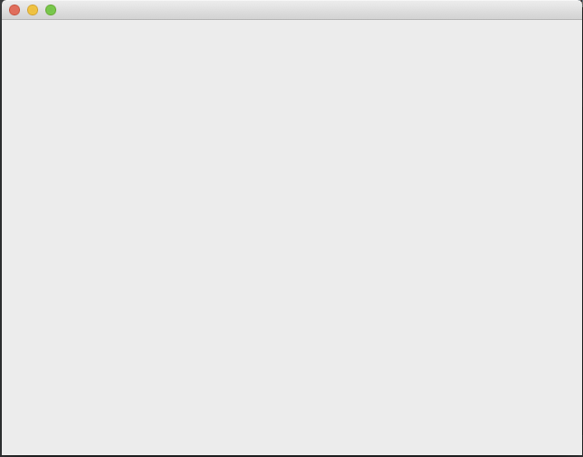

# 3D 컴퓨터 그래픽스
### 이 저장소는 2021년 동명대학교 게임공학과 그래픽스 프로그래밍 수업을 위한 저장소입니다.

## 실습 ##

### 실습 1: Qt 윈도우 생성

[01 Qt Window 생성](https://github.com/dknife/2021Graphics/blob/main/Source/01_Windowing/01_QtWindow.py)

### 오픈지엘 윈도우 생성
[00 Qt로 OpenGL을 사용할 수 있는 윈도우 만들기](https://github.com/dknife/2021Graphics/blob/main/Source/Ex01_00_WindowWQt.py)

[01 Qt로 OpenGL을 사용 연습](https://github.com/dknife/2021Graphics/blob/main/Source/Ex01_00_WindowWQt.py)

