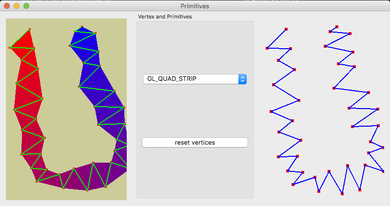

# 3D 컴퓨터 그래픽스
#### 이 저장소는 2021년 동명대학교 게임공학과 그래픽스 프로그래밍 수업을 위한 저장소입니다.
#### 이 저장소의 코드는 Windows 10 / MacOS Big Sur + Visual Studio Code + Python 3 + PyOpenGL + PyQt5 로 테스트되었습니다.
#### Big Sur 환경에서는 다음 파일을 수정해야 합니다.
##### /Library/Frameworks/Python.framework/Versions/3.9/lib/python3.9/site-packages/OpenGL/platform/ctypesloader.py
###### 수정할 내용

* [step 1|Primitive_Step1]

fullName = util.find_library( name )

를 아래와 같이 수정

if name == 'OpenGL':

    fullName = '/System/Library/Frameworks/OpenGL.framework/OpenGL'

## 강의 

##### 강의 0: 수업 오리엔테이션  [강의 자료](https://github.com/dknife/2021Graphics/blob/main/Lecture/2021Graphics_Lec1_intro.pdf) / 수업소개 [강의자료](https://github.com/dknife/2021Graphics/blob/main/Lecture/01_00_%EA%B0%95%EC%9D%98%EC%86%8C%EA%B0%9C.pdf)

##### 강의 1: 그래픽스 소개 [강의 자료](https://github.com/dknife/2021Graphics/blob/main/Lecture/2021Graphics_Lec1B_CGintro.pdf) / 파이썬 소개 [강의자료](https://github.com/dknife/2021Graphics/blob/main/Lecture/01_02_Python.pdf)

##### 강의 2: OpenGL + Qt 소개 [강의 자료](https://github.com/dknife/2021Graphics/blob/main/Lecture/2021Graphics_Lec3_GLintro.pdf)

##### 강의 3: 색 모델의 소개 [강의 자료](https://github.com/dknife/2021Graphics/blob/main/Lecture/Lec04_Colors_intro.pdf)

##### 강의 4: RGB 모델을 이용한 물체 표현 실습 [강의 자료](https://github.com/dknife/2021Graphics/blob/main/Lecture/2021Graphics_Lec1B_CGintro.pdf)

##### 강의 5: OpenGL 프리미티브 [강의 자료](https://github.com/dknife/2021Graphics/blob/main/Lecture/2021Graphics_Lec5_Primitives.pdf)

##### 강의 6: 카메라의 조작과 Z-버퍼 [강의 자료](https://github.com/dknife/2021Graphics/blob/main/Lecture/2021Graphics_Lec6_CamAndZBuffer.pdf)

##### 강의 7: 3차원 객체 만들기 [강의 자료](https://github.com/dknife/2021Graphics/blob/main/Lecture/2021Graphics_Lec7_object.pdf)

## 실습 ##

### 실습 1: Qt 윈도우 생성

* [01 Qt Window 생성](https://github.com/dknife/2021Graphics/blob/main/Source/01_Windowing/01_QtWindow.py)

* [02 Qt 위젯 생성](https://github.com/dknife/2021Graphics/blob/main/Source/01_Windowing/02_QtWidgets.py)

* [03 Qt 환경에서 OpenGL 윈도 띄우기](https://github.com/dknife/2021Graphics/blob/main/Source/01_Windowing/03_FirstGLWindow.py)

* [04 Qt 위젯과 상호작용하는 OpenGL](https://github.com/dknife/2021Graphics/blob/main/Source/01_Windowing/04_GLwQtWidgets.py)

### 실습 2: 컬러 모델 

* [01 광원, 재질, 관찰색](https://github.com/dknife/2021Graphics/blob/main/Source/02_Colors/01_RGBColors.py)

* [02 색의 보간](https://github.com/dknife/2021Graphics/blob/main/Source/02_Colors/02_ColorInterpolation.py)

### 실습 3: 프리미티브를 이용한 그리기

* [01 프리미티브 제어](https://github.com/dknife/2021Graphics/blob/main/Source/03_Primitives/01_Primitives.py)

* [02 프리미티브 제어 2](https://github.com/dknife/2021Graphics/blob/main/Source/03_Primitives/02_Primitives_2.py)

### 실습 4: 간단한 카메라 다루기와 깊이 버퍼 활용

* [01 원근투영 카메라 옮겨 놓기](https://github.com/dknife/2021Graphics/blob/main/Source/04_CamMove/01_CamMove.py)

* [02 카메라 애니메이션](https://github.com/dknife/2021Graphics/blob/main/Source/04_CamMove/02_CamMoveAni.py)

* [03 깊이 버퍼 없는 경우](https://github.com/dknife/2021Graphics/blob/main/Source/04_CamMove/03_NoDepthBuffer.py)

* [04 깊이 버퍼 사용](https://github.com/dknife/2021Graphics/blob/main/Source/04_CamMove/04_DepthBuffer.py)

### 실습 5: 입체 그리기

* [01 정사면체의 정점](https://github.com/dknife/2021Graphics/blob/main/Source/05_Object/01_Tetrahedron_Vertices.py)

* [02 정사면체 그려보기](https://github.com/dknife/2021Graphics/blob/main/Source/05_Object/02_Tetrahedron.py)

* [03 면을 분할하여 구 만들기](https://github.com/dknife/2021Graphics/blob/main/Source/05_Object/03_subdivision.py)

* [04 정점 색상 지정하여 면 그리기](https://github.com/dknife/2021Graphics/blob/main/Source/05_Object/04_subdivision_solid.py)
