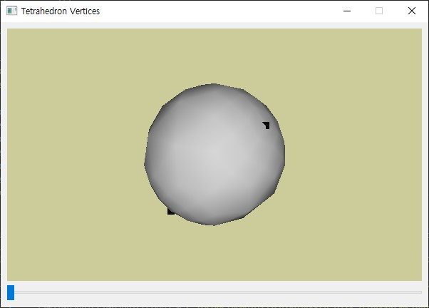

# 3D 컴퓨터 그래픽스
#### 이 저장소는 2021년 동명대학교 게임공학과 그래픽스 프로그래밍 수업을 위한 저장소입니다.
#### 이 저장소의 코드는 Windows 10 / MacOS Big Sur + Visual Studio Code + Python 3 + PyOpenGL + PyQt5 로 테스트되었습니다.
#### Big Sur 환경에서는 다음 파일을 수정해야 합니다.
##### /Library/Frameworks/Python.framework/Versions/3.9/lib/python3.9/site-packages/OpenGL/platform/ctypesloader.py
###### 수정할 내용

fullName = util.find_library( name )

를 아래와 같이 수정

if name == 'OpenGL':

    fullName = '/System/Library/Frameworks/OpenGL.framework/OpenGL'

* PyQt5를 PyQt6로 업그레이드 하면...

수정할 내용

1. QOpenGLWidget

PyQt6에서 QOpenGLWidget 클래스의 모듈 이동
from PyQt6.OpenGLWidgets import *

2. App 실행

exec_() => exec()

## 강의 

##### 강의 0: 수업 오리엔테이션  [강의 자료](https://github.com/dknife/2021Graphics/blob/main/Lecture/2021Graphics_Lec1_intro.pdf) / 수업소개 [강의자료](https://github.com/dknife/2021Graphics/blob/main/Lecture/01_00_%EA%B0%95%EC%9D%98%EC%86%8C%EA%B0%9C.pdf)

##### 강의 1: 그래픽스 소개 [강의 자료](https://github.com/dknife/2021Graphics/blob/main/Lecture/2021Graphics_Lec1B_CGintro.pdf) / 파이썬 소개 [강의자료](https://github.com/dknife/2021Graphics/blob/main/Lecture/01_02_Python.pdf)

##### 강의 2: OpenGL + Qt 소개 [강의 자료](https://github.com/dknife/2021Graphics/blob/main/Lecture/2021Graphics_Lec3_GLintro.pdf)

##### 강의 3: 색 모델의 소개 [강의 자료](https://github.com/dknife/2021Graphics/blob/main/Lecture/Lec04_Colors_intro.pdf)

##### 강의 4: RGB 모델을 이용한 물체 표현 실습 [강의 자료](https://github.com/dknife/2021Graphics/blob/main/Lecture/2021Graphics_Lec1B_CGintro.pdf)

##### 강의 5: OpenGL 프리미티브 [강의 자료](https://github.com/dknife/2021Graphics/blob/main/Lecture/2021Graphics_Lec5_Primitives.pdf)

##### 강의 6: 카메라의 조작과 Z-버퍼 [강의 자료](https://github.com/dknife/2021Graphics/blob/main/Lecture/2021Graphics_Lec6_CamAndZBuffer.pdf)

##### 강의 7: 3차원 객체 만들기 [강의 자료](https://github.com/dknife/2021Graphics/blob/main/Lecture/2021Graphics_Lec7_object.pdf)

##### 강의 8: 계층적 모델링 [강의 자료](https://github.com/dknife/2021Graphics/blob/main/Lecture/2021Graphics_Lec08_HierarchicalTransform.pdf)

##### 강의 9: 조명모델 [강의 자료](https://github.com/dknife/2021Graphics/blob/main/Lecture/Lec6_OGLLightingA.pdf)

##### 강의 10: 메시 렌더링 [강의 자료](https://github.com/dknife/2021Graphics/blob/main/Lecture/Lec08_mesh.pdf)

## 실습 ##

### 실습 1: Qt 윈도우 생성

* [01 Qt Window 생성](https://github.com/dknife/2021Graphics/blob/main/Source/01_Windowing/01_QtWindow.py)

* [02 Qt 위젯 생성](https://github.com/dknife/2021Graphics/blob/main/Source/01_Windowing/02_QtWidgets.py)

* [03 Qt 환경에서 OpenGL 윈도 띄우기](https://github.com/dknife/2021Graphics/blob/main/Source/01_Windowing/03_FirstGLWindow.py)

* [04 Qt 위젯과 상호작용하는 OpenGL](https://github.com/dknife/2021Graphics/blob/main/Source/01_Windowing/04_GLwQtWidgets.py)

### Offline 실습 2

* [Qt 실행](https://github.com/dknife/2021Graphics/blob/main/Source/Offline2/Qt1.py)
* [Qt 윈도우 만들어 보기](https://github.com/dknife/2021Graphics/blob/main/Source/Offline2/Qt2.py)
* [Qt로 OpenGL 시작](https://github.com/dknife/2021Graphics/blob/main/Source/Offline2/Qt3.py)
* [다각형 만들기](https://github.com/dknife/2021Graphics/blob/main/Source/Offline2/Qt4.py)
* [슬라이더 이벤트와 GLWidget 연결](https://github.com/dknife/2021Graphics/blob/main/Source/Offline2/Qt5.py)

### 실습 2: 컬러 모델 

* [01 광원, 재질, 관찰색](https://github.com/dknife/2021Graphics/blob/main/Source/02_Colors/01_RGBColors.py)

* [02 색의 보간](https://github.com/dknife/2021Graphics/blob/main/Source/02_Colors/02_ColorInterpolation.py)

### 실습 3: 프리미티브를 이용한 그리기

* [01 프리미티브 제어](https://github.com/dknife/2021Graphics/blob/main/Source/03_Primitives/01_Primitives.py)

* [02 프리미티브 제어 2](https://github.com/dknife/2021Graphics/blob/main/Source/03_Primitives/02_Primitives_2.py)

* [step1](https://github.com/dknife/2021Graphics/blob/main/Source/03_Primitives/step1.py) - 기본 구성 

* [step2](https://github.com/dknife/2021Graphics/blob/main/Source/03_Primitives/step2.py) - 프리미티브 선택

* [step3](https://github.com/dknife/2021Graphics/blob/main/Source/03_Primitives/step3.py) - 입력을 통한 정점 추가

* [step4](https://github.com/dknife/2021Graphics/blob/main/Source/03_Primitives/step4.py) - 완성

### 중간고사 답안

* [step1](https://github.com/dknife/2021Graphics/blob/main/Source/05_MidExam/mid_step1.py)

* [step2](https://github.com/dknife/2021Graphics/blob/main/Source/05_MidExam/mid_step2.py)

* [step3](https://github.com/dknife/2021Graphics/blob/main/Source/05_MidExam/mid_step3.py)

### 실습 4: 간단한 카메라 다루기와 깊이 버퍼 활용

* [중간고사 내용 개선](https://github.com/dknife/2021Graphics/blob/main/Source/05_MidExam/mid_step4.py)

### 실습 5: 간단한 3차원 공간 객체 그리기

* [오픈지엘 그리기 창 준비](https://github.com/dknife/2021Graphics/blob/main/Source/07_3DScene/3DObjects.py)

* [렌즈 변경과 축의 위치, 방향 변경](https://github.com/dknife/2021Graphics/blob/main/Source/07_3DScene/3DObjects_01Axis.py)

* [3차원 공간에 사각형 두 개 그리기](https://github.com/dknife/2021Graphics/blob/main/Source/07_3DScene/3DObjects_02Rects.py)

* [애니메이션을 추가하여 관찰](https://github.com/dknife/2021Graphics/blob/main/Source/07_3DScene/3DObjects_03Animation.py)

* [원근 카메라의 적용 (카메라 위치 변경 포함)](https://github.com/dknife/2021Graphics/blob/main/Source/07_3DScene/3DObjects_04PerspectiveView.py)

* [깊이버퍼를 사용하지 않을 때 문제](https://github.com/dknife/2021Graphics/blob/main/Source/07_3DScene/3DObjects_05DepthProblem.py)

* [깊이버퍼 적용 결과](https://github.com/dknife/2021Graphics/blob/main/Source/07_3DScene/3DObjects_06DepthTest.py)

* [큐브 완성](https://github.com/dknife/2021Graphics/blob/main/Source/07_3DScene/3DObjects_07Cube.py)

* [01 원근투영 카메라 옮겨 놓기](https://github.com/dknife/2021Graphics/blob/main/Source/04_CamMove/01_CamMove.py)

* [02 카메라 애니메이션](https://github.com/dknife/2021Graphics/blob/main/Source/04_CamMove/02_CamMoveAni.py)

* [03 깊이 버퍼 없는 경우](https://github.com/dknife/2021Graphics/blob/main/Source/04_CamMove/03_NoDepthBuffer.py)

* [04 깊이 버퍼 사용](https://github.com/dknife/2021Graphics/blob/main/Source/04_CamMove/04_DepthBuffer.py)

### 실습 5: 계층적 모델링

* [01 glPushMatrix/glPopMatrix를 이용하여 내부 변환영향 없애기](https://github.com/dknife/2021Graphics/blob/main/Source/08_HModeling/Transform_01.py)

* [02 지역좌표계를 이용하여 원하는 장면 구현하기](https://github.com/dknife/2021Graphics/blob/main/Source/08_HModeling/Transform_02.py)

* [03 로봇팔 구현해 보기](https://github.com/dknife/2021Graphics/blob/main/Source/08_HModeling/Transform_03.py)

* [04 로봇팔 움직이기](https://github.com/dknife/2021Graphics/blob/main/Source/08_HModeling/Transform_04.py)

### 실습 5-1: 로봇 제어하기

* [01 평면에 로봇 몸통 그리기](https://github.com/dknife/2021Graphics/blob/main/Source/Robot/robot01.py)

* [02 로봇 팔 달기](https://github.com/dknife/2021Graphics/blob/main/Source/Robot/robot02.py)

* [03 키보드로 로봇 제어하기](https://github.com/dknife/2021Graphics/blob/main/Source/Robot/robot03.py)

* [04 로봇 완성](https://github.com/dknife/2021Graphics/blob/main/Source/Robot/robot04.py)

### 실습 5-2: 태양계

* [01 원 그리기](https://github.com/dknife/2021Graphics/blob/main/Source/Soloar/solar01.py)

* [02 구 그리기](https://github.com/dknife/2021Graphics/blob/main/Source/Soloar/solar02.py)

* [03 태양계 모델](https://github.com/dknife/2021Graphics/blob/main/Source/Soloar/solar03.py)

### 실습 6: 입체 그리기

* [01 정사면체의 정점](https://github.com/dknife/2021Graphics/blob/main/Source/05_Object/01_Tetrahedron_Vertices.py)

* [02 정사면체 그려보기](https://github.com/dknife/2021Graphics/blob/main/Source/05_Object/02_Tetrahedron.py)

* [03 면을 분할하여 구 만들기](https://github.com/dknife/2021Graphics/blob/main/Source/05_Object/03_subdivision.py)

* [04 정점 색상 지정하여 면 그리기](https://github.com/dknife/2021Graphics/blob/main/Source/05_Object/04_subdivision_solid.py)

### 실습 단계 

* [1단계](https://github.com/dknife/2021Graphics/blob/main/Source/3DObject/step01.py)

* [2단계](https://github.com/dknife/2021Graphics/blob/main/Source/3DObject/step02.py)

* [3단계](https://github.com/dknife/2021Graphics/blob/main/Source/3DObject/step03.py) - 삼각형을 1번 분할하기

* [4단계](https://github.com/dknife/2021Graphics/blob/main/Source/3DObject/step04.py) - 삼각형을 여러번 분할하고 면으로 그리기

* [5단계](https://github.com/dknife/2021Graphics/blob/main/Source/3DObject/step05.py) - 조명 적용해 보기

### 조명 다루기

 

[점 광원 실습](https://github.com/dknife/2021Graphics/blob/main/Source/Lighting/Light_point.py)

[방향 광원 실습](https://github.com/dknife/2021Graphics/blob/main/Source/Lighting/Light_directional.py)

[집중 광원 실습](https://github.com/dknife/2021Graphics/blob/main/Source/Lighting/Light_spot.py)

 - 두 개의 집중 광원 실습

### 메시 다루기

#### 메시 데이터 

[메시 데이터 1](https://github.com/dknife/2021Graphics/blob/main/Source/08_mesh/mesh.txt) 

[메시 데이터 2](https://github.com/dknife/2021Graphics/blob/main/Source/08_mesh/mesh2.txt) 

[메시 데이터 더 구하기](https://people.sc.fsu.edu/~jburkardt/data/ply/ply.html)

#### 메시 로딩 

[메시 로딩 전](https://github.com/dknife/2021Graphics/blob/main/Source/08_mesh/mesh00.py) 

[메시 포인트](https://github.com/dknife/2021Graphics/blob/main/Source/08_mesh/mesh01.py) 

[메시 Wireframe](https://github.com/dknife/2021Graphics/blob/main/Source/08_mesh/mesh02.py) 

[메시 면 - flat](https://github.com/dknife/2021Graphics/blob/main/Source/08_mesh/mesh03.py) 

[메시 면 - smooth](https://github.com/dknife/2021Graphics/blob/main/Source/08_mesh/mesh04.py) 

[메시 애니메이션 - 저속](https://github.com/dknife/2021Graphics/blob/main/Source/08_mesh/mesh05.py) 

[메시 애니메이션 - 고속](https://github.com/dknife/2021Graphics/blob/main/Source/08_mesh/mesh06.py) 
